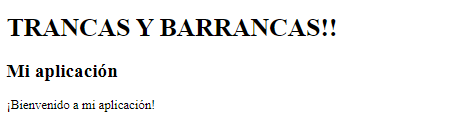

# Pagos Online con Strike y Express

Este proyecto es de el canal Fazt en YouTube y nos sirve para hacer pagos online usando Strike con un Servidor llamado Express. [Fazt video youtube](https://youtu.be/o9eij8FEvuA?list=PLKP3VSziSreOV5KR4FYsNfMUoSQ8jZ0Rt)

## Capturas de referancia


## Informacion importante

- Utilize un **entorno virtual** (venv)

- Utilice **express-handlebars**. y este es una librería útil para construir aplicaciones web dinámicas con Node.js y Express, ya que te permite crear vistas HTML reutilizables y mantener la separación de preocupaciones en tu código. (es una librería de plantillas). (tube problemas, solo me funciono la verson 3.0.2)


 ### bibiografia

[link]()

## Linea de tienpo

### vitualizamos

>1. virtualizamos con `venv`

Habrimos el cmd y nos vamos a la ruta de nuesto proyecto

    cd /ruta/a/mi/proyecto

Creamos el entorno virtual

    python -m venv venv

Y luego lo activamos

    venv\Scripts\activate.bat

### Empezamos a crear el servidor con Express

>2. creamos un proyecto de nodejs haci que lo iniciamos `npm init -y`

>3. Ahora insralaremos el modulo de express con `npm i express` es para tener un sevidor (Express)

>4. Y luego la libreria o mudulo de express-handlebars. Es para el manejo de las plantillas. Instalamos con `npm install express-handlebars@3.0.2` instalaremos exclusivamente la versión 3.0.2 por que con la version reciente hay problemas de compatibilidad.

>5. Creamos una carpeta src y dentro creamos un index.js (**`PROJECT/src/index.js`**).

>6. empezamos con las bases del servidor (**`PROJECT/src/index.js`**).

```js
const express = require('express');

//initlalizations
const app = express();

//start server
app.listen(3000, () => {
    console.log('server on port', 3000);
});
```
> 7. Veremos que ya esta funcuionando con `node src/index.js`. Ahora solo faltan las vistas

> 8. Ahora crearemos la estructura de nuestro servidor

primero creamos la carpeta **views** y dentro un archivo **index.hbs** (**`PROJECT/src/views/index.hbs`**)

Luego dentro de **views** creamos las siguientes carpetas:

**partials** (**`PROJECT/crs/views/partials`**)

y **layouts**, tambien dentro layouts un **main.hbs** este seria el layout de /views/index.js (**`PROJECT/crs/views/layouts/main.hbs`**)

> 9. hecho esto, en (**`PROJECT/crs/index.js`**) haremos lo siguiente:

```js
//initlalizations
const express = require('express');
const exphbs = require('express-handlebars');
const path = require('path');
const app = express();

// Creare Middleware
app.set('views', path.join(__dirname, 'views')); 

//Settings
 app.engine('.hbs', exphbs({
     defaultLayout: 'main',
     layoutsDir: path.join(app.get('views'), 'layouts'),
     extname: '.hbs'
 }));
app.set('view engine', 'hbs');

// Routes
app.get('/', (req, res) => {
    res.send('Hello World');
});

app.get('/about', (req, res) => {
    res.render('index', { 
        title: 'Mi aplicación', 
        message: '¡Bienvenido a mi aplicación!' 
    });
});

//start server
app.listen(3000, () => {
    console.log('server on port', 3000);
});
```

> 10. ahora esto en (**`PROJECT/src/views/layouts/main.hbs`**)

dato extra: en **PROJECT/src/views/index.hbs** aun no digitamos nada de codigo

```html
<!DOCTYPE html>
<html lang="en">
<head>
    <meta charset="UTF-8">
    <meta http-equiv="X-UA-Compatible" content="IE=edge">
    <meta name="viewport" content="width=device-width, initial-scale=1.0">
    <title>Document</title>
</head>
<body>
    <h1>TRANCAS Y BARRANCAS!!</h1>
    <h2> {{title}} </h2>
    <p> {{message}} </p>
</body>
</html>
```
Este es el resultado que tenemos hasta ahora. Sin errores todo correcto



### Rutas

> 11. A ordenar las rutas

>12. Hora vermos como subir datos a nuestro sevidor. Y para ello haremos lo siguiente en (**`PROJECT/src/index.js`**) en //middleware

```js
//Middleware
app.use(express.urlencoded({extended: false}));
app.use(express.json());
```

> 13. Ahora crearemos la carpeta routes y dentro de esa carpeta un index.js para las rutas del servidor (**`PROJECT/src/routes/index.js`**)

> 14. En (**`PROJECT/src/index.js`**) haremos lo siguiente.

```js
//Routes
app.use(require('./routes/index.js'));
```

>15. Ahora haremos los requerimientos en (**`PROJECT/src/routes/index.js`**). Y en vez de `app.get` usaremos `router.get`

```js
const { Router } = require('express');
const router = Router();

router.get('/', (req, res) => {
    res.send('hello world');
});

module.exports = router;
```

> 16. Ahora lo ideal es trasladar toda las rutas //Routes a (**`PROJECT/src/routes/index.js`**) de (**`PROJECT/src/index.js`**) y dejas solo esto: `app.use(require('./routes/index.js'));`

> 17. **Si hemos llegado a este punto la web debería de estar funcionando correctamente con todas las rutas**

### Archivos Estaticos

>18. Seguidamente para poder usar archivos css y imagenes entre otros crearemos una carpeta llamada public `src/public`

>19. Ahora en `src/index.js` haremos lo siguiente en //Static files

```js
//Static files
app.use(express.staic(path.join(__dirname, 'public')));
```


## Desarrollo del proyecto

- Lo primero que hice es crear el servidor con Express